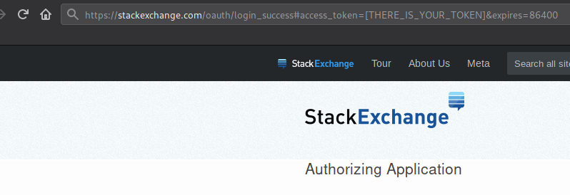

So Lang? So what?
---


### SoLang is the programming language of the future.
 - It's built around Stack Overflow Driven Development process and brings it to the next level
 - You don't ever need to write code which has been already written - just reference it!
 - Your code is always up to date - when someone update their answer on Stack Overflow, your code is automatically updated as well!
 - The code is usually more concise. Want to set-up a server with simple one-liner? That's the language for you!
 - You can write code which iterates over all solutions - find yourself the best one without copying and pasting code on and on again
 - Love writing viruses? Well, now you can write one which no antivirus software will detect. Nobody expect downloading malicious code from Stact Overflow.
 - You can fully control compilation process with all features of kotlin programming language
 - Parallel code fetching and compilation (so that it doesn't take ages)
 - Answer caching - if you fetch different fragments of code from the same answer - don't worry, the data will be cached. Stack Exchange API will be called only once.

### Example code

##### Hello World
```kotlin
fun main() = createCode {
    +StackOverflowSnippet(answerNumber = 1077349)
}.buildWith("python3", "script.py")
```

##### Another Hello World
```kotlin
fun main() = createCode {
    +StackOverflowSnippet(answerNumber = 11502683, codeBlockNumber = 2)
}.buildWith("cat", "hello.txt")
```

##### FizzBuzz
```kotlin
fun main() = createCode {
    +StackOverflowSnippet(answerNumber = 40427469, codeBlockNumber = 7)
}.buildWith("python2", "script.py")
```

##### FizzBuzz but up to 50 and completely skips not matching numbers
```kotlin
fun main() = createCode {
    +StackOverflowSnippet(answerNumber = 40427469, codeBlockNumber = 7) toLine 7 change ("101" to "51")
}.buildWith("python2", "script.py")
```

##### Create list of 1000 random dates, convert them to strings and then bubble-sort them
```kotlin
fun main() = createCode {
    +StackOverflowSnippet(answerNumber = 50165755) toLine 15 //declare randomdate
    +StackOverflowSnippet(answerNumber = 48980683, codeBlockNumber = 2) toLine 1 change ("random.random" to "randomTime") change ("x" to "my_list")  //generate list
    +StackOverflowSnippet(answerNumber = 902736, codeBlockNumber = 6) fromLine 3 change ("&gt;" to ">")//declare bubble and print sorted lits
}.buildWith("python2", "script.py")
```

##### Fetching specific answer revision
```kotlin
fun main() = createCode {
    SoLangConfiguration.soLangMode = SoLangConfiguration.SoLangMode.PRINT
    +SimpleSnippet("First revision:")
    +StackOverflowSnippet(answerNumber = 4362605, codeBlockNumber = 2, revisionNumber = 1)
    +SimpleSnippet("Second revision:")
    +StackOverflowSnippet(answerNumber = 4362605, codeBlockNumber = 2, revisionNumber = 2)
}.buildWith("python2", "script.py")
```

### Installation

To try SoLang you can just clone the repository and build with gradle. 

If you want to use SoLang in your own project, add it as a library to your build scripts:

`build.gradle`
```groovy
repositories {
    maven{ url "https://jitpack.io" }
    maven{ url "https://kotlin.bintray.com/kotlinx" }
}

dependencies {
    implementation 'com.github.krzysztofsroga.solang:0.1.3-alpha'
}
```

`build.gradle.kts`
```kotlin 
repositories {
    maven(url = "https://jitpack.io") 
    maven(url = "https://kotlin.bintray.com/kotlinx")
}

dependencies {
    implementation(group = "com.github.krzysztofsroga", name = "solang", version = "0.1.3-alpha")
}
```

### Configuration
You can configure some basic features of SoLang compiler
```kotlin
// SAFE is default mode. You will be prompted if the code and build command are okay
SoLangConfiguration.soLangMode = SoLangConfiguration.SoLangMode.SAFE

// UNSAFE is dangerous. It executes the code without any prompt. 
SoLangConfiguration.soLangMode = SoLangConfiguration.SoLangMode.UNSAFE

// PRINT mode just shows you generated code and bulid command
SoLangConfiguration.soLangMode = SoLangConfiguration.SoLangMode.PRINT
```

### Important notes
 - Without Stack Exchange API key you can download only 300 snippets every day. Snippets are downloaded every time you run your code. To compile more code get your token on on Stack Apps. See [FAQ](#faq)
 - To fulfill DRY principle, making copies of snippets is a little bit harder - every time you execute a method like `toLine`, `change`, the original snippet is modified. If you need the code in more than one place, please write a function.
 - Please, if you don't fetch specific revision of the answer, always use safe mode and verify it. It's because stack overflow answers can be changed. You probably don't want to see your computer executing `rm -rf ~/`.

### FAQ
#### How to get StackExchange token / Downloading more than 300 snippets a day
To get an access token, simply authorize SoLang application with your StackExchange account  
[SoLang Stack Exchange App](https://stackoverflow.com/oauth/dialog?client_id=14756&scope&redirect_uri=https://stackexchange.com/oauth/login_success)  
This way you'll get a token which will expire after one day. If you need non-expiring token, click [HERE](https://stackoverflow.com/oauth/dialog?client_id=14756&scope=no_expiry&redirect_uri=https://stackexchange.com/oauth/login_success)  
Your access token will be given in url of a page you're being redirected to.  
  
Now you can use it in your application:
```kotlin
SoLangConfiguration.apiToken = "YOUR TOKEN"
```
The matching key is already embedded in the application. If `apiToken` string is set to anything but empty string, it will be used in requests.
#### I wish it could (...)
Just open an issue and we can talk about it.
#### Can I use in production?
Well, it's not recommended, but as long as you fetch specific answer revision, it should work fine.
#### Why does it ask me if the code is okay before running it?
All of the answers on StackOverflow can be changed. If you want to disable this check [Configuration](#configuration)
#### How many snippets can I download?
You can download 300 snippets a day without access token. You can download 10000 with it.  
You may want to read: [StackApss: Is there a limit of api requests?](https://stackapps.com/questions/3055/is-there-a-limit-of-api-requests)
#### How complex code can I create with it?
You tell me

### Api Docs
Documentation is still being created, hence it may be lacking something.
#### Basic code structure
```kotlin
fun main() = createCode {
    //Your snippets go here
}.buildWith("command", "filename")
```
Function `createCode` takes a lambda with receiver `CodeBuilder`, returns `SoCode`
```kotlin
fun createCode(block: CodeBuilder.() -> Unit): SoCode
```
Method `buildWith` builds `SoCode` saves code to file and complies it using given command. Redirects program output to console.
```kotlin
fun SoCode.buildWith(buildScript: String, targetFile: String)
```
#### Creating snippets
`SimpleSnippet` just stores your code in unchanged form
```kotlin
class SimpleSnippet(code: String) : Snippet()
```
`StackOverflowSnippet` downloads given answer(and caches it in case other snippets would base on the same one), then cuts selected block number from it. In case you specified revision, all revisions are downloaded and then the one selected is used.
In case no revision is specified, the newest one is used.
```kotlin
class StackOverflowSnippet(
    answerNumber: Int,
    codeBlockNumber: Int,
    revisionNumber: Int? = null
) : Snippet()
```
#### Adding snippets to your code
To add a snippet to code just mark it with `+` symbol. You can assign snippet to variable if you want
```kotlin
createCode {
    +SimpleSnippet("Hello world!") //this snippet is just appended
    val s = SimpleSnippet("Code in SoLang!")
    +s
    +s
}
```
This will result in output:
```
Hello world!
Code in SoLang!
Code in SoLang!
```
#### Modifying snippets
This section is being worked on... Stay tuned!  
You can add modifiers to snippets. Modifiers are queued until code compilation and executed all at the same time.

Take care! When you modify a snippet, there isn't created a copy!

#### Experimental features
This section will be published in near future

### Release ready TODOs
 - [x] Upload to [Jitpack](https://jitpack.io/)
 - [x] Memoize downloaded snippets [MnemoniK](https://github.com/aballano/MnemoniK)
 - [x] Cleanup dependencies
 - [x] Add option to start code block numbering from 1
 - [ ] Real time code output and interaction (for some reason `inheritIO` does not work)
 - [x] Design Logo
 - [x] Start writing tests
 - [x] Safe mode which shows generated code before execution (well, answer can be edited... it isn't quite safe)
 - [x] Allow usage of specific answer version
 - [x] Api key usage
 - [x] ~~Fix `toLine` after `fromLine` usage~~ Let's say that's the intended behavior - if you cut `fromLine` first then line numeration for `toLine` changes. Hence `snippet fromLine 4 toLine 8` is the same thing as `snippet takeLines 4..12`
 - [x] Fix all visibility modifiers

### Less important TODOs
 - BuildScript class, build script fetching
 - Analyze possibility of returning subclass of `Snippet` from SurroundingSnippet - not extending CodeBuilder, but creating its own
 - Infix fun parametrize / parametrizedWith
 - Full test coverage

### Future plans
 - Allow self-referencing SoLang code on Stack Overflow. Sharing recursive snippet could be funny.
 - Write plugins for most popular IDEs and editors - it should show you hints how do your snippets look like.
 - Support Microsoft Windows target.
 - Downloading code from other Stack Exchange pages.
 - Downloading code from GitHub.
 - Add support for plugins (other code sources).
 - Create add-ons for chrome and firefox.

##### Disclaimer: This is NOT official language created by Stack Overflow. 
